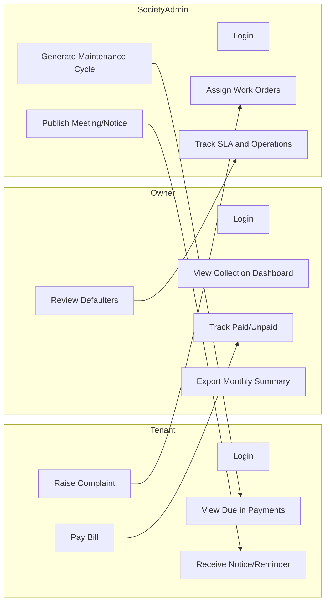
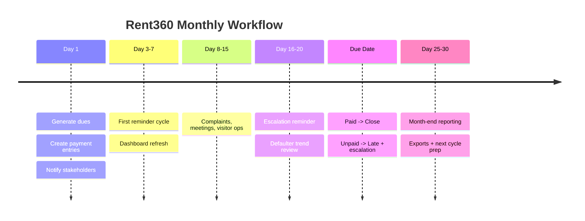

# ?? Rent360
## Complete Application Workflow & Operating Model

Rent360 is a unified Property Operating System that connects Rental Management, Society Operations, Facility Management, and Marketplace into one event-driven, role-based platform.

This document explains how the entire system works end-to-end.

## 1?? End-to-End System Flow (High-Level View)
### ?? How Rent360 Operates

1. User logs in (Tenant, Owner, Society Admin, Security, Vendor, Admin).
2. Role and permissions are loaded dynamically.
3. Sidebar and accessible modules are rendered based on role.
4. User performs an action (payment, complaint, meeting, visitor entry, etc.).
5. That module becomes the source of truth for the data.
6. System emits domain event.
7. Connected modules update automatically.
8. Notifications are sent to relevant roles.
9. Dashboards and reports refresh in real time.

Rent360 is event-driven, not page-driven.

## 2?? Role-Centric Experience (Real Usage)

Rent360 is designed around real-world roles, not just features.

### ?? Tenant

What a tenant actually does:
1. Views rent and maintenance dues.
2. Pays bills.
3. Raises complaints.
4. Tracks complaint resolution.
5. Receives notices and meeting alerts.
6. Manages visitor approvals.

Tenant view = clarity + accountability.

### ?? Owner

What an owner actually needs:
1. Monitor property occupancy.
2. Track payment status (Paid / Due / Late).
3. Identify defaulters.
4. Monitor maintenance collection.
5. Export monthly summaries.
6. Track overall portfolio performance.

Owner view = financial visibility + portfolio control.

### ?? Society Admin

What an admin manages daily:
1. Maintenance cycle generation.
2. Work-order assignments.
3. Complaint tracking.
4. Meeting scheduling.
5. Visitor management.
6. SLA monitoring.
7. Operational reporting.

Admin view = governance + operational control.

## 3?? Module Connectivity (System Integration Map)

Rent360 modules are interconnected.

### ?? How modules depend on each other

1. Properties & Units define occupancy structure.
2. Tenants consumes occupancy context.
3. Payments manages financial state.
4. Society Operations handles meetings, notices, complaints, and visitors.
5. Communications sends reminders and alerts.
6. Dashboard & Reports aggregate system-wide data.
7. Settings & Authorization control visibility and permissions.

No module operates in isolation.

## 4?? Event-Based Connectivity (System Sync Model)

Rent360 uses domain events to keep modules synchronized.

### ?? Core Event Examples

| Event | System Reaction |
|---|---|
| `payment.created` | Tenant reminder + owner pending count update |
| `payment.paid` | Owner dashboard update + receipt notification |
| `payment.overdue` | Defaulter list update + escalation reminder |
| `complaint.created` | Admin alert + vendor queue update |
| `meeting.scheduled` | Residents notified |
| `visitor.entered` | Activity feed update |
| `tenant.checkin` | Occupancy + billing update |

This keeps dashboards live and aligned.

## 5?? Monthly Operating Cycle (Day 1 -> Day 30)

Rent360 follows a structured financial and operational rhythm.

### ?? Monthly Flow

1. Day 1:
- Rent and maintenance dues generated.
- Payment entries created with `Due` status.
- Tenant + owner/admin notified.

2. Day 3-10:
- First reminder for unpaid dues.
- Dashboard pending counts updated.

3. Day 8-20:
- Complaints, work-orders, meetings, visitors handled.
- Operational activities continue.

4. Due Date:
- Paid entries -> Closed.
- Unpaid entries -> Late.
- Escalation reminder triggered.

5. Day 25-30:
- Reports generated.
- Exports prepared.
- Collection and SLA summaries reviewed.
- Next cycle prepared.

Rent360 ensures nothing is forgotten.

## 6?? Role Interaction Flow (Swimlane View)

This illustrates cross-role dependencies.

## 7?? Monthly Timeline Visualization

## 8?? Why Rent360 Solves Real Problems

Before Rent360:
1. Excel sheets
2. WhatsApp complaints
3. Paper visitor logs
4. Manual maintenance tracking
5. Disconnected rent systems

After Rent360:
1. Unified platform
2. Real-time dashboards
3. Transparent complaint tracking
4. Automated reminders
5. Exportable reports
6. Role-based clarity

It replaces chaos with systemized governance.

## 9?? How the System Stays Clean & Scalable

1. Domain modules are isolated.
2. Events connect modules.
3. Roles control visibility.
4. Filters maintain contextual accuracy.
5. Shared components enforce UI consistency.
6. Export service ensures compliance and reporting.

It is built for growth, not shortcuts.

## ?? Quick Explanation for New Engineers

Rent360 works like a connected chain:
1. Domain module creates or updates data.
2. System emits a domain event.
3. Dependent modules refresh automatically.
4. Dashboards update.
5. Notifications trigger.
6. Each role acts on relevant information.

This keeps Tenant, Owner, and Society Admin aligned every month.

## ?? Final Summary

Rent360 is:
1. A Financial Control System
2. A Society Governance Platform
3. A Facility Management Engine
4. A Visitor and Security Tracker
5. A Property Marketplace
6. A Role-Based Operating System

## It is an ecosystem. "Prop OS"
